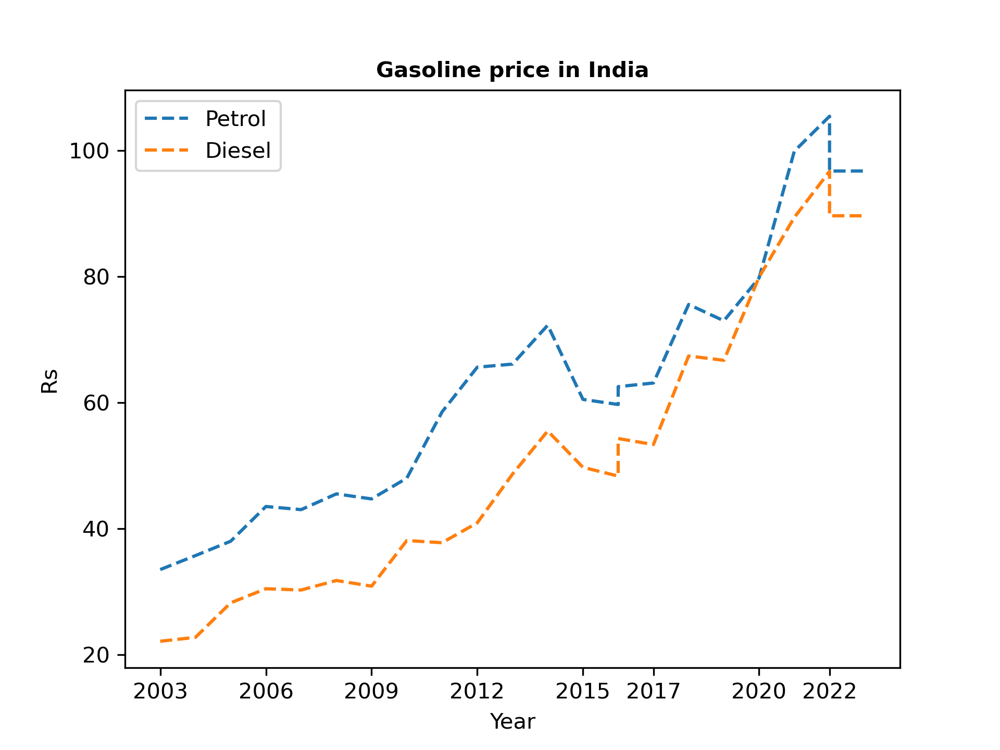

# Petrol and Diesel Price Analysis

This Python project utilizes Matplotlib to visualize the historical prices of petrol and diesel in India from 2003 to 2023. The graph provides insights into the trends and fluctuations in fuel prices over the years.

## Project Overview

The project aims to:

- Retrieve historical petrol and diesel price data.
- Process and clean the data for analysis.
- Visualize the data using Matplotlib to create an informative graph.

## Requirements

To run this project, you'll need:

- Python 3.x
- Matplotlib library

Clone this repo
    git clone https://github.com/Praveensv11/PythonCodeArchive.git

## Data Source

The historical petrol and diesel price data used in this project was sourced from [https://www.mycarhelpline.com/index.php?option=com_easyblog&view=entry&id=808&Itemid=91]

## Graph Output

## Contributing

Contributions are welcome! If you have any suggestions, bug fixes, or improvements, feel free to open an issue or submit a pull request.

Thank you for checking out the Petrol and Diesel Price Analysis project! If you have any questions or feedback, please don't hesitate to reach out.
